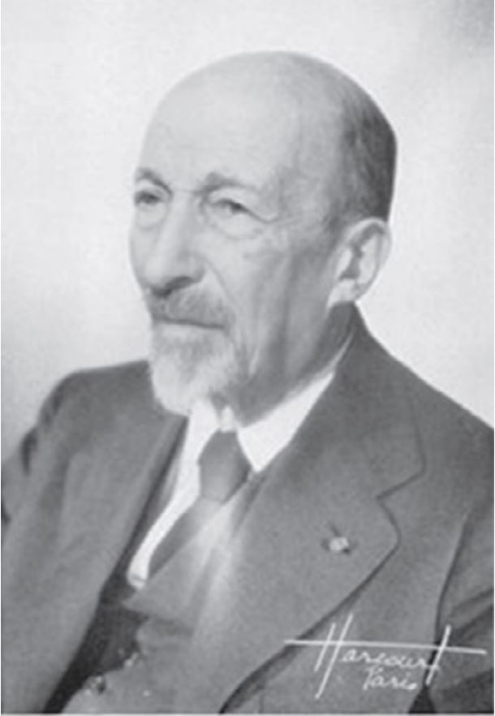

In this section we will discuss a little about the starting point of solving inverse problem and than get started with description of forward problem followed by inverse problem. Here, we will take a look of the linear and non-linear inverse problem.

## Motivation 

## History
<!--
[//]: 
-->

**

## Forward Problem

## Inverse Problem

### Linear inverse-problem

### Non-Linear inverse-problem
